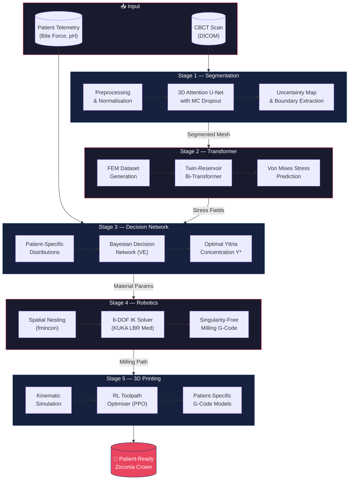
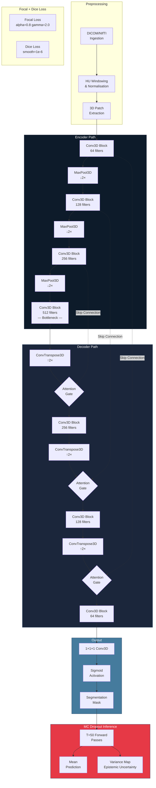
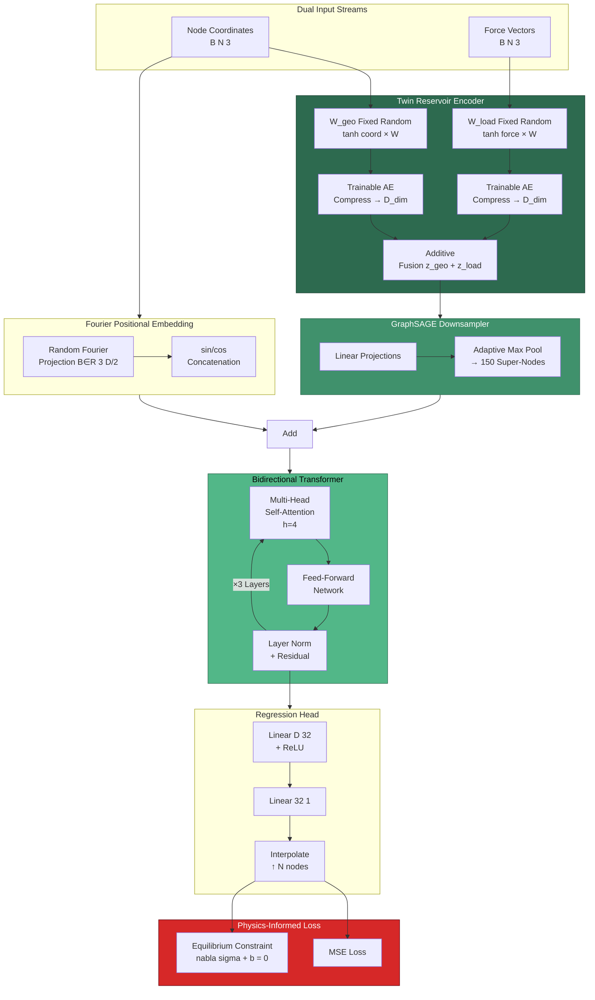
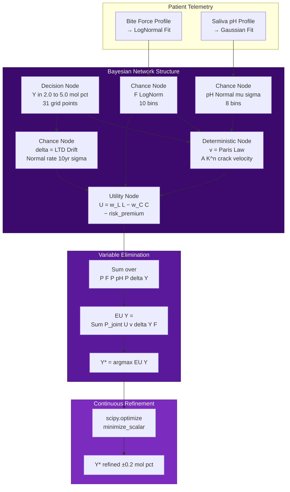
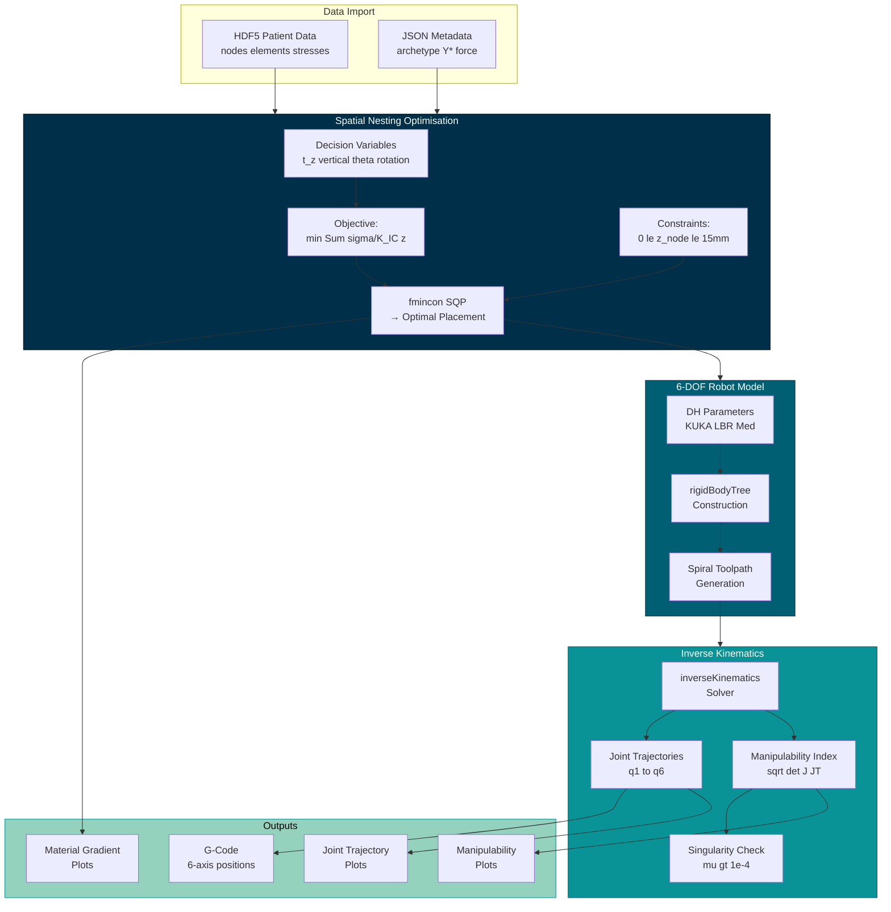
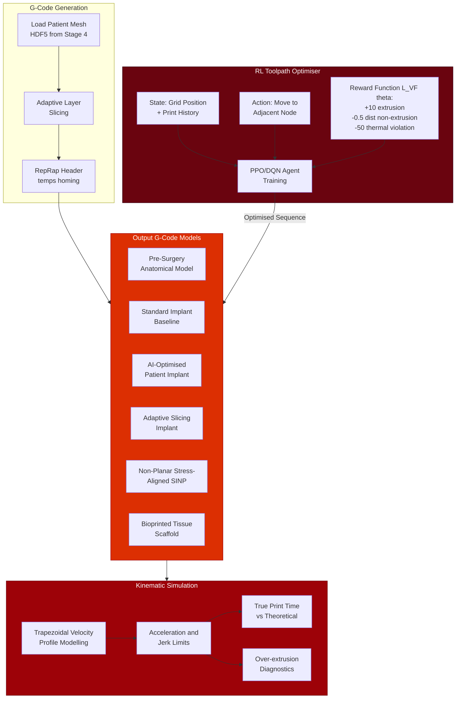

<p align="center">
  <h1 align="center">🦷 AI-Driven Dental Zirconia Crown Manufacturing</h1>
  <p align="center">
    <strong>End-to-end AI pipeline for personalised dental zirconia crown fabrication</strong><br/>
    <em>From CBCT scan to patient-ready 3D-printed crown — fully automated</em>
  </p>
  <p align="center">
    <a href="#overview">Overview</a> •
    <a href="#workflow">Workflow</a> •
    <a href="#stage-architectures">Stage Architectures</a> •
    <a href="#prerequisites">Prerequisites</a> •
    <a href="#installation">Installation</a> •
    <a href="#usage">Usage</a> •
    <a href="#project-structure">Project Structure</a> •
    <a href="#contributing">Contributing</a> •
    <a href="#license">License</a>
  </p>
  <p align="center">
    
    
    
    
    
  </p>
</p>

---

## Overview

This repository implements a **five-stage, multi-language AI pipeline** for manufacturing patient-specific dental zirconia crowns. The system ingests raw CBCT (Cone-Beam Computed Tomography) scans and autonomously produces optimised G-code for both CNC robotic milling and 3D printing of functionally graded zirconia implants.

### Key Innovations
- **3D Attention U-Net** with Monte Carlo Dropout for boundary uncertainty quantification
- **Twin-Reservoir Bidirectional Graph Transformer** for real-time FEM stress prediction
- **Bayesian Decision Network** with Variable Elimination for optimal yttria stabiliser selection
- **Singularity-free robotic milling** via MATLAB Robotics System Toolbox inverse kinematics
- **RL-optimised toolpath generation** for thermally aware 3D printing

### Languages & Technologies

| Language | Usage |
|----------|-------|
| **Python** (`.py`) | Deep learning (PyTorch), data preprocessing, decision networks, RL agents, G-code generation |
| **MATLAB** (`.m`) | Robotics kinematics (Robotics System Toolbox), Weibull reliability analysis, spatial nesting optimisation |
| **G-Code** (`.gcode`) | CNC milling paths, 3D printing instructions (RepRap flavour) |
| **JSON** | Configuration, kernel metadata, optimisation results |
| **CSV** | FEM mesh data, patient stress fields, force telemetry |
| **HDF5/MAT** | Cross-platform data exchange between Python ↔ MATLAB |

---

## Workflow

The complete end-to-end pipeline flows through five sequential stages:



---

## Stage Architectures

### Stage 1 — 3D Attention U-Net Segmentation



### Stage 2 — Twin-Reservoir Bidirectional Graph Transformer



### Stage 3 — Bayesian Decision Network



### Stage 4 — Robotic Milling (MATLAB)



### Stage 5 — RL-Optimised 3D Printing



---

## Prerequisites

### Required Software

| Software | Version | Purpose |
|----------|---------|---------|
| **Python** | >= 3.9 | Core pipeline (Stages 1, 2, 3, 5) |
| **PyTorch** | >= 2.0 | Deep learning models |
| **MATLAB** | >= R2024b | Robotics and reliability analysis (Stage 4) |
| **Git** | >= 2.40 | Version control |

### Python Dependencies

```
torch >= 2.0
numpy >= 1.24
scipy >= 1.10
h5py >= 3.8
matplotlib >= 3.7
```

### MATLAB Toolboxes (Stage 4)

- **Robotics System Toolbox** — `rigidBodyTree`, `inverseKinematics`
- **Optimization Toolbox** — `fmincon` (SQP algorithm)
- **Statistics and Machine Learning Toolbox** — Weibull reliability analysis

### Optional

| Tool | Purpose |
|------|---------|
| **NVIDIA GPU + CUDA** | Accelerated training (Stages 1 and 2) |
| **Kaggle API** | Push kernels for cloud training |
| **h5py** | HDF5 data exchange between Python and MATLAB |

---

## Installation

```bash
# 1. Clone the repository
git clone https://github.com/Runtime-Slayers/AI-Driven-Dental-Zirconia-Crown-Manufacturing.git
cd AI-Driven-Dental-Zirconia-Crown-Manufacturing

# 2. Create Python environment
python -m venv venv
source venv/bin/activate        # macOS / Linux
# venv\Scripts\activate         # Windows

# 3. Install Python dependencies
pip install torch numpy scipy h5py matplotlib

# 4. (Optional) For Kaggle kernel deployment
pip install kaggle
```

---

## Usage

### Run the Full Pipeline

```bash
# Stage 1 — Segmentation
python Stage1_Segmentation/Code_Files/preprocess_data.py
python Stage1_Segmentation/Code_Files/train_segmentation.py

# Stage 2 — Transformer Stress Prediction
python Stage2_Transformer/Code_Files/generate_fem_dataset.py
python Stage2_Transformer/Code_Files/train_transformer.py

# Stage 3 — Decision Network Optimisation
python Stage3_DecisionNetwork/Code_Files/decision_network.py
python Stage3_DecisionNetwork/Code_Files/export_to_matlab.py

# Stage 4 — Robotic Milling (MATLAB)
# Open MATLAB and run:
#   >> run_milling_optimization

# Stage 5 — 3D Printing
python Stage5_3D_Printing/generate_gcode_models.py
python Stage5_3D_Printing/rl_toolpath_generator.py
python Stage5_3D_Printing/kinematic_simulation.py
```

### Kaggle Cloud Training

Each stage includes a `kaggle_kernel/` directory with a self-contained script and `kernel-metadata.json` for one-click deployment:

```bash
cd Stage1_Segmentation/kaggle_kernel
kaggle kernels push
```

---

## Project Structure

```
AI-Driven-Dental-Zirconia-Crown-Manufacturing/
│
├── Stage1_Segmentation/
│   ├── Code_Files/
│   │   ├── model.py                    # 3D Attention U-Net architecture
│   │   ├── train_segmentation.py       # Training loop + MC Dropout inference
│   │   ├── preprocess_data.py          # DICOM → normalised patches
│   │   ├── process_telemetry.py        # Patient bite-force telemetry processor
│   │   └── visualize_uncertainty.py    # Uncertainty map visualisation
│   ├── kaggle_kernel/                  # Kaggle cloud training kernel
│   ├── kaggle_master_kernel/           # Full pipeline kernel
│   └── extract_datasets.py            # Dataset extraction utility
│
├── Stage2_Transformer/
│   ├── Code_Files/
│   │   ├── model.py                    # Twin-Reservoir Bi-Transformer
│   │   ├── train_transformer.py        # Training loop (MSE + physics loss)
│   │   ├── generate_fem_dataset.py     # Synthetic FEM dataset generator
│   │   ├── fem_solver.py              # Simplified FEM solver
│   │   └── train.py                   # Alternative training entry point
│   └── kaggle_kernel/                  # Kaggle deployment kernel
│
├── Stage3_DecisionNetwork/
│   ├── Code_Files/
│   │   ├── decision_network.py         # Bayesian network + VE solver
│   │   ├── run_optimization.py         # Batch optimisation runner
│   │   ├── plot_optimization_results.py # Result visualisation
│   │   └── export_to_matlab.py         # HDF5 + JSON export for Stage 4
│   ├── kaggle_kernel/                  # Kaggle deployment
│   ├── Image_Outputs/                  # Ablation and regret plots
│   └── Outputs/                        # Decision network results (JSON)
│
├── Stage4_Robotics/
│   ├── run_milling_optimization.m      # Main MATLAB entry point
│   ├── analyze_zirconia_reliability.m  # Weibull reliability analysis
│   ├── master_addon_visualizer.m       # Advanced visualisation dashboard
│   ├── novel_addon_visualizations.m    # Research visualisations
│   ├── *.png                           # Output plots
│   └── *.gcode                         # Generated milling G-code
│
├── Stage5_3D_Printing/
│   ├── generate_gcode_models.py        # Patient-specific G-code models
│   ├── rl_toolpath_generator.py        # RL agent (PPO) for toolpath
│   ├── kinematic_simulation.py         # Firmware-aware kinematic sim
│   └── *.gcode                         # Generated G-code files
│
├── Extra/
│   ├── export_models.py                # ONNX model export utility
│   └── export_transformer.py           # Transformer export utility
│
├── CONTRIBUTING.md
├── LICENSE
└── README.md
```

---

## Contributing

We welcome contributions! Please see [CONTRIBUTING.md](CONTRIBUTING.md) for guidelines.

### How to Contribute
1. **Fork** the repository
2. **Create** a feature branch (`git checkout -b feature/your-feature`)
3. **Commit** your changes (`git commit -m 'Add your feature'`)
4. **Push** to the branch (`git push origin feature/your-feature`)
5. **Open** a Pull Request

---

## License

This project is licensed under the **MIT License** — see the [LICENSE](LICENSE) file for details.

Contributions are freely available under the same licence.

---

<p align="center">
  <sub>Built with ❤️ by <a href="https://github.com/Runtime-Slayers">Runtime Slayers</a></sub>
</p>
